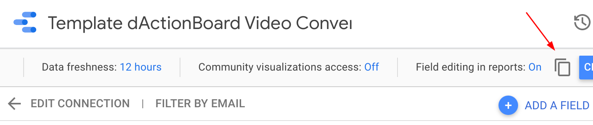
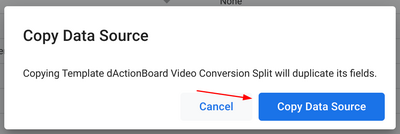
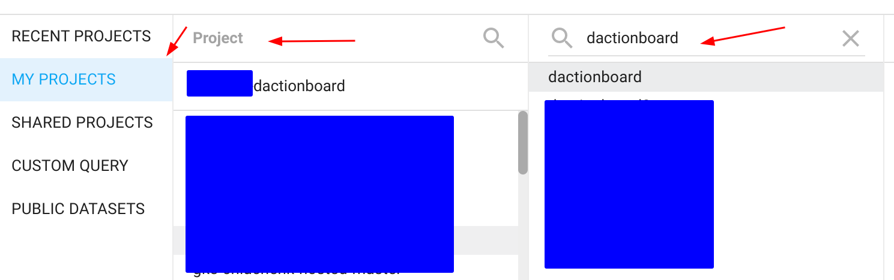
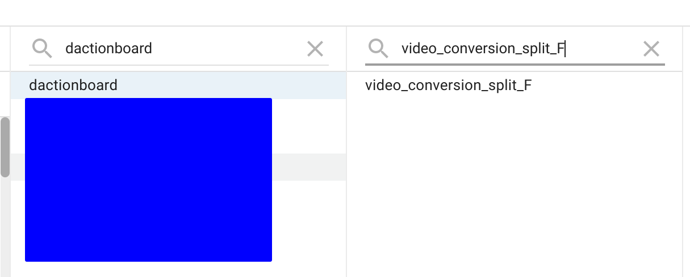
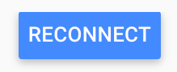
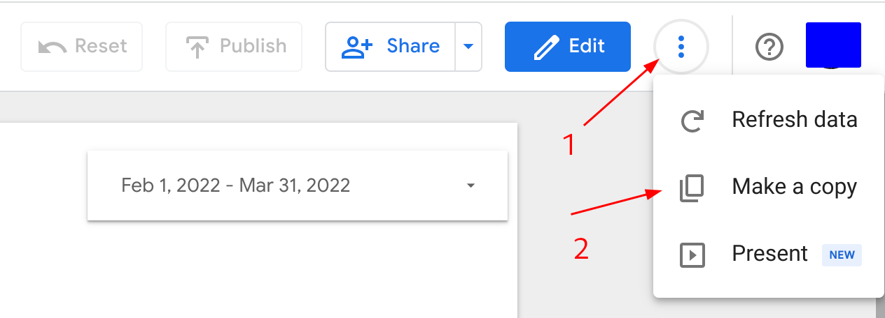
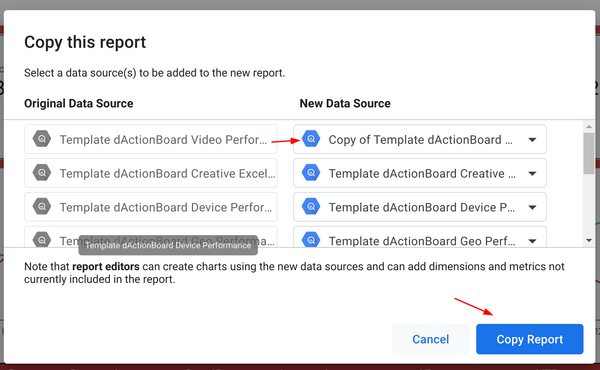
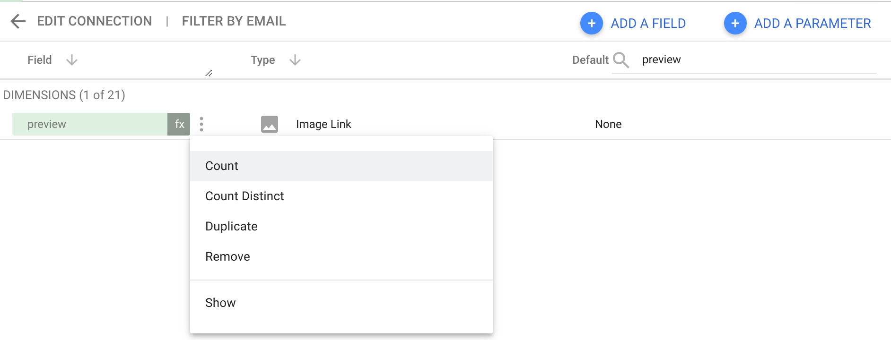

# Creating dActionBoard in Looker Studio

Once data for dActionBoard data are generated and stored in BigQuery you can
proceed with replication.

> **_IMPORTANT:_** After the dashboard is created you need to enable image previews, read details on how it can be done [here](#enable-image-previews).

## Creating dashboard with Looker Studio Dashboard Cloner

Install [Looker Studio Dashboard Cloner](https://github.com/google/looker-studio-dashboard-cloner),
go the [`dactionboard`](../) folder and run the following command in the terminal:

```
lsd-cloner --answers=dashboard_answers.json
```

You will be presented with a series of questions (regarding BigQuery project and dataset)
and after that the tool will open a link in your browser with a copy of the dashboard.
> Comment report_id in `answers.json` to supply custom report_id to the tool.

## Creating the dashboard from config

If for some reason you cannot install Looker Studio Dashboard Cloner you can always
replicate the dashboard by running `create_dashboard.sh` script:

1. Go to [`dactionboard`](../) folder

2. Run `bash scripts/create_dashboard.sh -c dactionboard.yaml`
command in the terminal, there `dactionboard.yaml` is the name config for dactionboard.\
You can provide optional arguments to the script:
* `--report-name="<YOUR_NAME_FOR_THE_DASHBOARD>"` - where YOUR_NAME_FOR_THE_DASHBOARD is the name of the generated dashboard.
* `--report-id=<ID_OF_REPORT>` - custom dashboard id (useful when you made some customization to the dashboard and want to clone it)
* `--project=<YOUR_BQ_PROJECT_NAME>` - name of BigQuery project which contains dActionBoard data
* `--dataset=<YOUR_BQ_DATASET_NAME>` - name of BigQuery dataset which contains dActionBoard data

## Manual creation

The process of manual replication consists of two steps:

* Replication of datasources
* Replication of dashboard


Before replicating the dashboard you need to make copies of datasources that power up the dashboard.
Replication of the datasources is important since they contains multiple calculated metrics which could be problematic to create from scratch.

Make a copy of each of the following 8 datasources used in the template dashboard.
* [video_performance](https://datastudio.google.com/c/u/0/datasources/93fafc92-48e4-46cb-937c-748757d209e4)
* [ad-video_performance](https://datastudio.google.com/c/u/0/datasources/ec8dcbbf-cb84-461b-a866-47beb286131a)
* [geo_performance](https://datastudio.google.com/c/u/0/datasources/eae3304d-bf7a-4a12-9bf7-87d81d5877f6)
* [device_performance](https://datastudio.google.com/c/u/0/datasources/7d8a8244-7aad-46cd-8e30-815337a32c32)
* [gender_performance](https://datastudio.google.com/c/u/0/datasources/891232ad-0a3e-4c34-ad02-3c2d58f175f7)
* [age_performance](https://datastudio.google.com/c/u/0/datasources/9391d85e-7b1a-4b3a-8324-42715f02a0e7)
* [video_conversion_split](https://datastudio.google.com/c/u/0/datasources/c15b4e79-af56-4eba-b1e7-562ec1c4b9f4)
* [creative_excellence](https://datastudio.google.com/c/u/0/datasources/5cf90865-eda5-4db3-9deb-31d6ccee7b07)

In order to replicate a datasource, please do the following:
* Click on the datasource link above.
* Click on *Make a copy of this datasource*

	

* Confirm copying by clicking *Copy Data Source*

	

* Select *MY PROJECTS* and either pick a project or enter project id manually (this should be the project where dActionBoard tables are located)
* In Dataset select a BQ dataset where dActionBoard tables are located

	
* Select a table from the dataset which the name similar to Data Source name (i.e., if Data Source is called Video Conversion Split look for the table which is called video_conversion_split)

	

* Confirm copying by clicking *RECONNECT* button.

	


> Don’t forget to rename the datasource so you can find it easily. I.e. such name as *Copy of Template dActionBoard Video Performance* is a bit mouthful, you can name it simply *dActionBoard Video Performance* or *YOUR-COMPANY-NAME dActionBoard Video Performance*.

* Repeat the steps above for all the datasources.

Now that you’ve copied each of the datasources, make a copy of the dashboard and replace each of the template’s datasources with the corresponding datasource you copied.

## Replication of the dashboard

> Please ensure that ALL datasources are created before proceeding to replication of the dashboard.

You can access the template version of the dashboard [here](https://datastudio.google.com/c/u/0/reporting/ad41d2ca-1d20-43a2-97b8-6cfa141e0f7a/page/T20t/).

In order to replicate dashboard please do the following:

* make a [copy of the dashboard](https://support.google.com/datastudio/answer/7175478?hl=en#zippy=%2Cin-this-article) by clicking on *More options - Make a copy*.

	

* In *Copy this report* window map original datasources to the ones you created in the previous step.

	

Once all template datasources are replaced with new ones, click *Copy Report* and enjoy your new shiny dActionBoard!


## Enable image previews

After the dashboard is created all rendered images are [disabled](https://support.google.com/looker-studio/answer/7570489?hl=en#zippy=%2Cin-this-article). To activate them follow the steps below:

* Click on **Edit** button
* Go to **Resource**  and select the **dactionboard_ad_video_performance_copy** datasource.
* Search for `preview` field
* Click on three docs and select **Show** to enable preview

	
